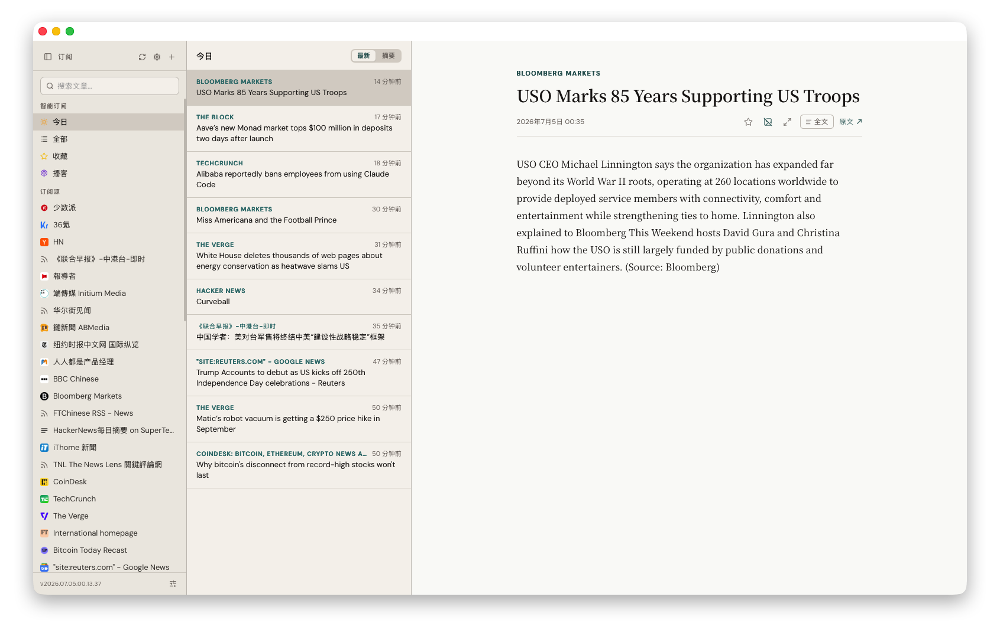
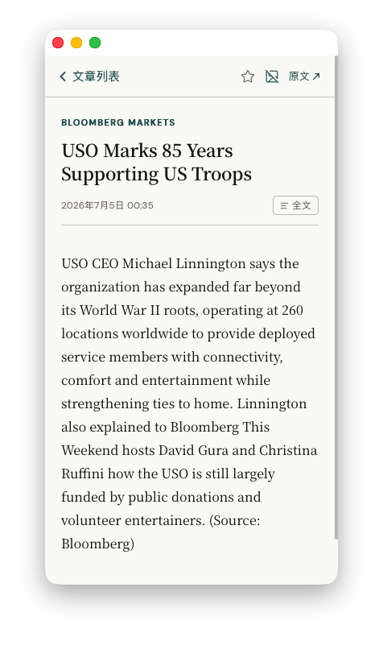

# RSS Reader

**English** | [简体中文](README.zh-CN.md)

A self-hosted, full-stack RSS reader with a clean reading-first UI, full-text article
extraction, and a podcast player. It also has a built-in **MCP server** that lets an LLM
(Claude, etc.) read and manage your feeds as tools — including summarizing the article
you're currently reading.

React + PWA client (TypeScript), and a single-binary **Go backend** (`server-go/`) over
SQLite that serves the API and the static client.

> **Live demo:** _add your deployed URL here_

<p>
  
  
</p>

---

## Highlights

- **Reading-first UI** — three-pane feed / list / reader layout on desktop, with a
  mobile-adapted PWA (installable, offline shell, parallax panel transitions).
- **No read/unread state — by design** — deliberately drops unread counts and
  "mark as read" mechanics, so there's no inbox-zero guilt. Browse by recency and
  star what's worth keeping instead.
- **Text-only mode (无图模式)** — a toggle that strips images, video, iframes and
  embeds from the article body for distraction-free reading; the preference persists.
- **RSSHub support** — subscribe with short `rsshub://path` URLs (e.g.
  `rsshub://anthropic/research`) that resolve at fetch time to your own RSSHub instance,
  configurable in Settings (default `http://localhost:1200`).
- **Full-text extraction** — when a feed only ships a truncated summary, fetch the
  original page and extract clean readable content with Mozilla Readability.
- **Podcast support** — feeds with audio enclosures get an inline player.
- **Full-text search** with feed-scoped filtering.
- **OPML import** — migrate your subscriptions from any other reader.
- **Durable archive** — every fetched article is persisted for search/research; a
  size-capped maintenance pass prunes the oldest non-starred items automatically.
- **Optional auth** — cookie-session basic auth gates non-localhost access, so the same
  binary runs fully-private on localhost or publicly behind a Cloudflare Tunnel.

## AI / MCP integration

The Go server exposes a [Model Context Protocol](https://modelcontextprotocol.io) endpoint
(Streamable HTTP transport) with **13 tools**, mounted at `/mcp` on the loopback-only,
no-auth listener (`LOCAL_API_PORT`), so an MCP-capable client can drive the reader
conversationally:

| Area | Tools |
|------|-------|
| Feeds | `list_feeds`, `add_feed`, `rename_feed`, `delete_feed`, `import_opml` |
| Reading | `get_all_articles`, `get_today_articles`, `get_feed_articles`, `get_starred_articles`, `get_starred_count` |
| State | `toggle_star`, `get_current_article` |
| Content | `fetch_article_content` |

Each tool is a thin wrapper over the same HTTP API the web UI uses, so the AI surface and
the UI can never drift apart. The standout is **`get_current_article`** — it reads the
article open in the browser UI, so you can ask *"summarize what I'm reading"* or *"star
this and find related posts"* and have it just work.

## Architecture

```
client/     React 19 + TypeScript + Vite + Zustand + react-router, PWA
server-go/  Go + go-sqlite3 (SQLite), chi router — a single compiled binary
            ├─ jobs        scheduled feed fetch/persist + maintenance
            ├─ content     go-readability full-text extraction
            ├─ favicon     fetched + cached per feed
            ├─ mcp         Model Context Protocol server (13 tools), loopback-only
            └─ maintenance DB size cap / old-article pruning
```

- **Single binary.** The backend compiles to one cgo binary (`mattn/go-sqlite3`); no
  bundler, no runtime dependencies beyond the SQLite file it manages.
- **One source of truth.** MCP tools call the HTTP API over loopback rather than
  re-implementing logic, keeping the AI and UI behaviors identical.
- Tested on both ends (`go test` for the server, Vitest for the client); the server is
  vetted with `staticcheck`, the client linted/formatted with [oxlint / oxfmt](https://oxc.rs).

## Getting started

Requires **Go ≥ 1.26** (backend, built with cgo) and **Node ≥ 22** (client + tooling).

```bash
# install client + root tooling deps (the Go backend uses go modules — no npm install)
npm install && cd client && npm install && cd ..

# run the Go server (:3002) + client (:3000) together
npm run dev
```

Open http://localhost:3000, then add a feed URL or import an OPML file.

The loopback-only, no-auth companion listener (`LOCAL_API_PORT`, default 4002) also serves
the MCP endpoint at `/mcp` (see the AI / MCP integration section above).

### Auth (optional)

Set `AUTH_USER` / `AUTH_PASS` (in the environment, or in an env file pointed to by
`RSS_ENV_FILE`) to require login on every request — for exposing the reader over a public
tunnel. Leave them empty for localhost-only private use.

## Tech stack

- **Frontend:** React 19, TypeScript, Vite, Zustand, react-router, vite-plugin-pwa
- **Backend:** Go 1.26, chi, mattn/go-sqlite3, go-readability, gofeed, lumberjack
- **AI:** Model Context Protocol (Streamable HTTP), via `modelcontextprotocol/go-sdk`
- **Tooling:** go test + staticcheck (server), oxlint + oxfmt + Vitest (client)

## License

MIT — see [LICENSE](LICENSE).
