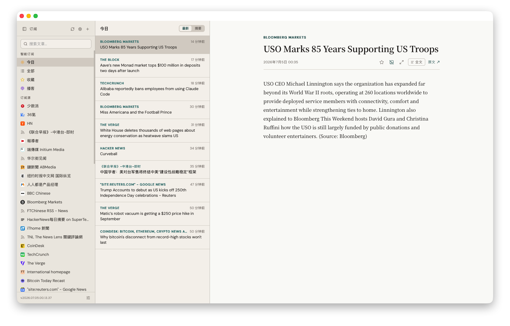
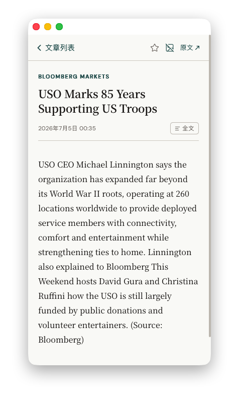

<p align="center">
  
</p>

<h1 align="center">FeedOverflow</h1>

<p align="center">A reading-first, self-hosted RSS reader.</p>

<p align="center">
  <strong>English</strong> · <a href="README.zh-CN.md">简体中文</a>
</p>

A self-hosted, full-stack RSS reader with a clean reading-first UI, full-text article
extraction, a podcast player, and optional **AI title translation**. It also has a built-in
**MCP server** that lets an LLM (Claude, etc.) read and manage your feeds as tools —
including summarizing the article you're currently reading.

React + PWA client (TypeScript), and a single-binary **Go backend** (`server-go/`) over
SQLite that serves the API and the static client.

> **Live demo:** <https://demo.royl.uk:8443> — public sandbox with sample data, resets every 6 hours.

<table>
<tr>
<td></td>
<td></td>
</tr>
</table>

---

## Highlights

- **Reading-first UI** — three-pane feed / list / reader layout on desktop, with a
  mobile-adapted PWA (installable, offline shell, parallax panel transitions).
- **No read/unread state — by design** — deliberately drops unread counts and
  "mark as read" mechanics, so there's no inbox-zero guilt. Browse by recency and
  star what's worth keeping instead.
- **Text-only mode (无图模式)** — a toggle that strips images, video, iframes and
  embeds from the article body for distraction-free reading; the preference persists.
- **RSSHub support** — subscribe with short `rsshub://path` URLs (e.g.
  `rsshub://anthropic/research`) that resolve at fetch time to your own RSSHub instance,
  configurable in Settings (default `http://localhost:1200`).
- **Full-text extraction** — when a feed only ships a truncated summary, fetch the
  original page and extract clean readable content with Mozilla Readability.
- **Podcast support** — feeds with audio enclosures get an inline player.
- **Collections (合集)** — saved cross-feed streams. A collection is the *union* of its
  rules, each rule `feed AND include-keyword AND NOT exclude-keyword`, matched against
  titles and summaries. It's a lens over articles already stored, not a source: it fetches
  nothing and costs no extra polling. Latin keywords match whole words only, so `AI` never
  hits `said`.
- **AI title translation** — optional, off by default: non-Chinese titles are rendered into
  Chinese by any OpenAI-compatible endpoint. See [AI features](#ai-features) below.
- **Push notifications** — opt-in per feed, delivered over Web Push with a VAPID keypair the
  server generates on first use. Sent **only** from the background poller, so an on-demand
  refresh never notifies you about the article you're already reading; capped at 3 per feed
  per poll, and tapping one deep-links straight to that article. Each device subscribes
  separately (on iOS, install the PWA to the home screen first).
- **Full-text search** with feed-scoped filtering.
- **OPML import** — migrate your subscriptions from any other reader.
- **Durable archive** — every fetched article is persisted for search/research; a
  size-capped maintenance pass prunes the oldest non-starred items automatically.
- **Optional auth** — cookie-session basic auth gates non-localhost access, so the same
  binary runs fully-private on localhost or publicly behind a tunnel.

## AI features

### Title translation

Non-Chinese article titles can be translated into Chinese by any OpenAI-compatible
`/chat/completions` endpoint — base URL, model and API key are set in Settings, behind one
global switch that is off by default. Bring your own key; nothing is sent anywhere until you
turn it on.

- **One title per request, never a batch.** A model that drops an element from a batched
  response shifts every following translation onto the wrong article — silently, and
  permanently.
- **Context, not a bare string.** Each request carries the article's feed name and summary
  alongside the title, so a title is translated as what the piece is actually about.
- **Chinese feeds cost nothing.** A title that is more than 30% Han characters is skipped
  before any request is made — the switch is global precisely because it doesn't need to be
  per-feed.
- **The original is never overwritten.** The list shows the translation, the reader shows
  both, and search matches either.
- Translation runs in its own background worker, so it covers every fetch path and never adds
  upstream latency to a page load. Turning it on reaches back 24 hours, not the whole archive.

### MCP server

The Go server exposes a [Model Context Protocol](https://modelcontextprotocol.io) endpoint
(Streamable HTTP transport) with **13 tools**, mounted at `/mcp` on the loopback-only,
no-auth listener (`LOCAL_API_PORT`), so an MCP-capable client can drive the reader
conversationally:

| Area | Tools |
|------|-------|
| Feeds | `list_feeds`, `add_feed`, `rename_feed`, `delete_feed`, `import_opml` |
| Reading | `get_all_articles`, `get_today_articles`, `get_feed_articles`, `get_starred_articles`, `get_starred_count` |
| State | `toggle_star`, `get_current_article` |
| Content | `fetch_article_content` |

Each tool is a thin wrapper over the same HTTP API the web UI uses, so the AI surface and
the UI can never drift apart. The standout is **`get_current_article`** — it reads the
article open in the browser UI, so you can ask *"summarize what I'm reading"* or *"star
this and find related posts"* and have it just work.

## Architecture

```
client/     React 19 + TypeScript + Vite + Zustand + react-router, PWA
server-go/  Go + go-sqlite3 (SQLite), chi router — a single compiled binary
            ├─ jobs        scheduled feed fetch/persist + maintenance + translation worker
            ├─ content     go-readability full-text extraction
            ├─ favicon     fetched + cached per feed
            ├─ translate   OpenAI-compatible client for title translation
            ├─ push        Web Push (VAPID) sender for per-feed notifications
            ├─ mcp         Model Context Protocol server (13 tools), loopback-only
            └─ maintenance DB size cap / old-article pruning
```

- **Single binary.** The backend compiles to one cgo binary (`mattn/go-sqlite3`); no
  bundler, no runtime dependencies beyond the SQLite file it manages.
- **One source of truth.** MCP tools call the HTTP API over loopback rather than
  re-implementing logic, keeping the AI and UI behaviors identical.
- Tested on both ends (`go test` for the server, Vitest for the client); the server is
  vetted with `staticcheck`, the client linted/formatted with [oxlint / oxfmt](https://oxc.rs).

## Getting started

Requires **Go ≥ 1.26** (backend, built with cgo) and **Node ≥ 22** (client + tooling).

```bash
# install client + root tooling deps (the Go backend uses go modules — no npm install)
npm install && cd client && npm install && cd ..

# run the Go server (:3002) + client (:3000) together
npm run dev
```

Open http://localhost:3000, then add a feed URL or import an OPML file.

The loopback-only, no-auth companion listener (`LOCAL_API_PORT`, default 4002) also serves
the MCP endpoint at `/mcp` (see the AI features section above).

### Auth (optional)

Set `AUTH_USER` / `AUTH_PASS` (in the environment, or in an env file pointed to by
`RSS_ENV_FILE`) to require login on every request — for exposing the reader over a public
tunnel. Leave them empty for localhost-only private use.

## Configuration

Every setting is an environment variable, all of them optional — with no environment at
all the server runs on `:3002` against `./rss.db`. Only `AUTH_USER`/`AUTH_PASS` become
effectively required, and only once you expose the app beyond localhost.

Runtime settings that belong to *content* rather than deployment — the RSSHub base URL, the
translation endpoint/model/API key, per-feed push — live in the app's Settings UI and the
database, not here.

| Variable | Default | Purpose |
|---|---|---|
| `PORT` | `3002` | Public listener, bound to all interfaces. Auth-gated when `AUTH_USER`/`AUTH_PASS` are set. |
| `LOCAL_API_PORT` | `4002` | Loopback-only companion listener (`127.0.0.1`), never authenticated and never exposed. Also serves the MCP endpoint at `/mcp`. |
| `AUTH_USER` | *(empty)* | Login username. **Set both this and `AUTH_PASS`** to gate the public listener; leaving either empty disables auth entirely. |
| `AUTH_PASS` | *(empty)* | Login password. See above — half-configured auth is no auth. |
| `RSS_DB` | `rss.db` | SQLite file path. Created if absent; the parent directory must already exist. |
| `DB_MAX_SIZE_MB` | `2048` | Size cap. Past it, maintenance trims the oldest **non-starred** articles down to 90% and `VACUUM`s. Starred articles are never deleted. |
| `REFRESH_CONCURRENCY` | `6` | How many feed fetch+persist chains may run at once — the single throttle across every fetch path (poll fan-out, startup warming, on-demand reads). |
| `LOG_DIR` | *(empty)* | Directory for rotated NDJSON logs (`app.log`). Empty logs to stderr instead. The directory must exist. |
| `CLIENT_DIST` | `client/dist` | Built client served on the public listener. Empty disables static serving (API only). |
| `PUSH_SUBJECT` | `https://rss.royl.uk` | VAPID `sub` claim for Web Push — a contact identifier for the push service operator, not an endpoint anyone connects to. Any valid `https:` URL or `mailto:` URI works; it need not match your origin. |
| `RSS_ENV_FILE` | *(unset)* | Path to a `KEY=VALUE` file to load before reading the rest. See below. |
| `RSS_DISABLE_JOBS` | *(unset)* | Any non-empty value skips **all** background work — polling, maintenance, WAL checkpoints, cache warming. For tests and contract diffing; not for production. |

### How to set them

**Directly**, for a one-off run:

```bash
AUTH_USER=me AUTH_PASS=secret npm run server
```

**Via an env file**, for a persistent install. `RSS_ENV_FILE` itself must come from the
real environment — it names the file, so it cannot live inside it:

```bash
RSS_ENV_FILE=/path/to/.env npm run server
```

Values already present in the environment **win over the file** — the file fills gaps, it
never overrides. That way a shell variable or a systemd/launchd `Environment=` entry can
override one setting without editing the file.

**With Docker**, through `.env` (see [Run with Docker](#run-with-docker)). `PORT`,
`LOCAL_API_PORT`, `RSS_DB`, `LOG_DIR`, and `CLIENT_DIST` are already set in the image to
container-appropriate paths — override them only if you know why.

### Client build-time variables

The client is a static bundle, so its variables are read by Vite at **build** time and
baked in; setting them at runtime does nothing.

| Variable | Purpose |
|---|---|
| `VITE_DEMO_MODE` | Non-empty renders the public demo instance's banner. A no-op in a normal build. |

## Run with Docker

No Go/Node toolchain needed — just Docker. The image is a multi-stage build (client +
cgo Go binary), and the SQLite DB and logs persist on a named volume.

```bash
cp .env.example .env        # optional: set AUTH_USER/AUTH_PASS, tuning
docker compose up -d        # serves the app on http://localhost:3002
```

For `rsshub://` feeds, start a bundled RSSHub too (leave it out if you only use plain RSS):

```bash
docker compose --profile rsshub up -d
```

Then set **rsshub_base_url** to `http://rsshub:1200` in Settings. Data lives on the
`rss-data` volume; back it up (or `docker compose down` **without** `-v`) to keep your
articles and stars.

## Tech stack

- **Frontend:** React 19, TypeScript, Vite, Zustand, react-router, vite-plugin-pwa
- **Backend:** Go 1.26, chi, mattn/go-sqlite3, go-readability, gofeed, lumberjack
- **AI:** Model Context Protocol (Streamable HTTP), via `modelcontextprotocol/go-sdk`;
  title translation over any OpenAI-compatible `/chat/completions` endpoint
- **Notifications:** Web Push (VAPID), `SherClockHolmes/webpush-go`
- **Tooling:** go test + staticcheck (server), oxlint + oxfmt + Vitest (client)

## License

AGPL-3.0 — see [LICENSE](LICENSE). If you run a modified version as a network service, you must offer its source to your users.
